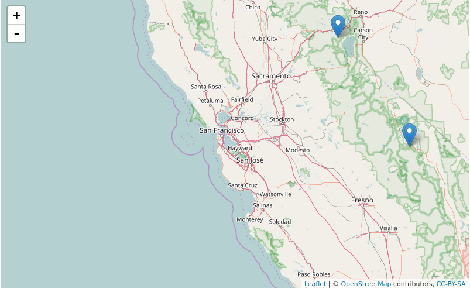

Since I submitted the [*geojsonR* package](https://CRAN.R-project.org/package=geojsonR) I was interested in running geospatial MongoDB queries using GeoJson data. I decided to use PyMongo (through the reticulate package) after opening two Github issues [here](https://github.com/jeroen/mongolite/issues/7) and [here](https://github.com/rstudio/reticulate/issues/81). In my opinion, the PyMongo library is huge and covers a lot of things however, my intention was to be able to run geospatial queries from within R.

##### The GeoMongo package

The GeoMongo package allows the user,

* to insert and query **only** GeoJson data using the **geomongo** R6 class
* to read data in either json (through the geojsonR package) or BSON format (I'll explain later when BSON is necessary for inserting data)
* to validate a json instance using a schema using the **json_schema_validator()** function (input parameters are R named lists)
* to utilize MongoDB console commands using the **mongodb_console()** function. The *mongodb_console()* function takes advantage of the base R *system()* function. For instance, MongoDB console commands are necessary in case of bulk import / export of data as documented [here](https://docs.mongodb.com/manual/reference/program/mongoimport/) and [here](https://docs.mongodb.com/manual/reference/program/mongoexport/).


<br>

I was able to reproduce the majority of geospatial MongoDB queries ( System Requirements : MongoDB (>= 3.4) and Python (>= 3.5) ) using a number of blog posts on the web, however I'll take advantage of the following two in order to explain how one can use the **GeoMongo** package for this purpose:

* [first example blog post](http://thecodebarbarian.com/80-20-guide-to-mongodb-geospatial-queries) [ The 80/20 Guide to MongoDB Geospatial Queries, by Valeri Karpov]
* [second documentation example](https://docs.mongodb.com/manual/geospatial-queries/) [ Geospatial Queries, in MongoDB documentation ]

<br>

##### queries based on [first example blog post](http://thecodebarbarian.com/80-20-guide-to-mongodb-geospatial-queries)


When inserting data using the *geomongo* R6 class the user has the option (via the *TYPE_DATA* parameter) to either give a *character string (or vector)*, a *list*, a *file* or a *folder of files* as input. To start with, I'll use the following character strings ( they appear in the first example blog post , the "_id" 's were removed),


```{r, eval = F}

library(GeoMongo)


# important : the property-names of each geojson object should be of type character string

loc1 = '{
          "name" : "Squaw Valley",
          "location" : {
              "type" : "Point",
              "coordinates" : [
                  -120.24,
                  39.21
              ]
          }
      }'


loc2 = '{
        "name" : "Mammoth Lakes",
        "location" : {
            "type" : "Point",
            "coordinates" : [
                -118.9,
                37.61
            ]
        }
    }'


loc3 = '{
        "name" : "Aspen",
        "location" : {
            "type" : "Point",
            "coordinates" : [
                -106.82,
                39.18
            ]
        }
    }'


loc4 = '{
        "name" : "Whistler",
        "location" : {
            "type" : "Point",
            "coordinates" : [
                -122.95,
                50.12
            ]
        }
    }'


# create a vector of character strings

char_FILES = c(loc1, loc2, loc3, loc4)           

```


<br>

Before inserting the data one should **make sure that MongoDB is running on the Operating System**. Information on how to **install MongoDB** can be found [here](https://docs.mongodb.com/manual/installation/).

<br>

The **geomongo** R6 class will be initialized and a database and collection will be created,

<br>

```{r, eval = F}

init = geomongo$new(host = 'localhost', port = 27017)    # assuming MongoDB runs locally

getter_client = init$getClient()                          # get MongoClient()

init_db = getter_client[["example_db"]]                   # create a new database

init_col = init_db$create_collection("example_col")       # create a new collection

```

<br>

After the preliminary steps, one can continue by inserting the *char_FILES* object to the relevant database / collection using the **geoInsert** method. The *TYPE_DATA* parameter equals here to *dict_many* meaning it can take either a *list of lists (nested list)* or a *character vector of strings*, 

<br>

```{r, eval = F}

init$geoInsert(DATA = char_FILES,              # input data
               
               TYPE_DATA = 'dict_many',        # character vector of strings as input
               
               COLLECTION = init_col,          # specify the relevant collection
               
               GEOMETRY_NAME = "location")     # give the 'geometry name' of each geo-object

```

<br>

One can now run various commands to check the correctness of the inserted data,

<br>

```{r, eval = F}

init_db$collection_names()    # prints out the collection names of the relevant database

```


```{r, eval = F}

"example_col"

```


```{r, eval = F}

init_col$find_one()          # prints one of the inserted geometry objects

```


```{r, eval = F}

$`_id`
5984a0b742b2563fb5838f6a

$location
$location$type
[1] "Point"

$location$coordinates
[1] -120.24   39.21


$name
[1] "Squaw Valley"

```


```{r, eval = F}

init_col$count()          # prints the number of the inserted geometry objects

```


```{r, eval = F}

[1] 4

```

<br>

I'll continue reproducing some of the geo-queries of the [first example blog post](http://thecodebarbarian.com/80-20-guide-to-mongodb-geospatial-queries) from within an R-session. 

<br>

The first query is about the number of locations in the state of Colorado, where Colorado is approximated as the below GeoJson square,

<br>


```{r, eval = F}

{
  "type": "Polygon",
  "coordinates": [[
    [-109, 41],
    [-102, 41],
    [-102, 37],
    [-109, 37],
    [-109, 41]
  ]]
}


```

<br>

and the corresponding MongoDB query would be,

<br>

```{r, eval = F}

db.locations.find({
...   location: {
...     $geoIntersects: {
...       $geometry: {
...         type: "Polygon",
...         coordinates: [[
...           [-109, 41],
...           [-102, 41],
...           [-102, 37],
...           [-109, 37],
...           [-109, 41]
...         ]]
...       }
...     }
...   }
... })

```

<br>

This query can be *translated* in R in the following way:

* *curly braces* correspond to *R-lists*
* *arrays* (of size 2) to *R-vectors*,

<br>

```{r, eval = F}

query_geoIntersects = list('location' = 
                             
                             list('$geoIntersects' = 
                                    
                                    list('$geometry' = 
                                           
                                           list(
                                             
                                             type = "Polygon", 
                                                
                                             coordinates = 
                                               
                                               list(
                                                 
                                                 list(
                                                   
                                                   c(-109, 41), 
                                                   
                                                   c(-102, 41), 
                                                   
                                                   c(-102, 37), 
                                                   
                                                   c(-109, 37), 
                                                   
                                                   c(-109, 41)
                                                   )
                                                 )
                                             )
                                         )
                                  )
                           )


```


<br>

and the **find** METHOD of **geoQuery** function will be used to return locations which are within the boundaries of Colorado,

<br>


```{r, eval = F}

loc_intersect = init$geoQuery(QUERY = query_geoIntersects,      # query from previous chunk
                                  
                              METHOD = "find",                  # the method to use
                              
                              COLLECTION = init_col,            # the collection to use

                              GEOMETRY_NAME = "location",       # the geometry name to use
                              
                              TO_LIST = FALSE)                  # returns a data.table

loc_intersect

```

<br>

The output can be returned either as a *list* or as a *data.table*,

<br>

```{r, eval = F}

# data.table format

   location.type location.coordinates1 location.coordinates2  name                       id
1:         Point               -106.82                 39.18 Aspen 5984a0b742b2563fb5838f6c

```

<br>

The next few code chunks will show how to return documents that are *within a certain distance of a given point* using the *geoWithin* and *centerSphere* operators (locations with a square of circumradius 300 miles centered on San Francisco, approximately latitude 37.7, longitude -122.5).


```{r, eval = F}

# MongoDB query

db.locations.find({
...   location: {
...     $geoWithin: {
...       $centerSphere: [[-122.5, 37.7], 300 / 3963.2]
...     }
...   }
... })

```

<br>

and the corresponding query in R,

<br>

```{r, eval = F}

geoWithin_sph = list('location' = 
                       
                       list('$geoWithin' = 
                            
                            list('$centerSphere' = 
                                   
                                   list(
                                     
                                     c(-122.5, 37.7), 300 / 3963.2)
                                 )
                          )
                   )


# no need to specify again the "COLLECTION" and "GEOMETRY_NAME" parameters
# as we use the same initialization of the R6 class with the previous query

res_geoWithin_sph = init$geoQuery(QUERY = geoWithin_sph,
                                  
                                  METHOD = "find")
res_geoWithin_sph

```


```{r, eval = F}

# example output

   location.type location.coordinates1 location.coordinates2  
1:         Point               -118.90                 37.61
2:         Point               -120.24                 39.21

            name                       id
   Mammoth Lakes 5984a0b742b2563fb5838f6b
    Squaw Valley 5984a0b742b2563fb5838f6a
   
```

<br>

One can read more about the magic number 3963.2 (radius of the Earth) either in the [first example blog post](http://thecodebarbarian.com/80-20-guide-to-mongodb-geospatial-queries) or in the [MongoDB documentation](https://docs.mongodb.com/manual/tutorial/calculate-distances-using-spherical-geometry-with-2d-geospatial-indexes/).

<br>

Here one can also plot the output locations using the **leaflet** package,

<br>

```{r, eval = F}

map_dat <- leaflet::leaflet()

map_dat <- leaflet::addTiles(map_dat)

map_dat <- leaflet::addMarkers(map_dat, 
                               
                               lng = unlist(res_geoWithin_sph$location.coordinates1), 
                               
                               lat = unlist(res_geoWithin_sph$location.coordinates2))
map_dat

```

<br>



<br>

The next query utilizes the **aggregate** method to return the locations *sorted by distance from a given point*,

<br>

```{r, eval = F}

# MongoDB query

db.locations.aggregate([{
...   $geoNear: {
...     near: {
...       type: 'Point',
...       coordinates: [-122.5, 37.1]
...     },
...     spherical: true,
...     maxDistance: 900 * 1609.34,
...     distanceMultiplier: 1 / 1609.34,
...     distanceField: 'distanceFromSF'
...   }
... }])

```

<br>

and the corresponding query in R,

<br>

```{r, eval = F}

query_geonear = list('$geoNear' = 
                       
                       list(near = 
                              
                              list(
                                
                                type = "Point", 
                                  
                                coordinates = 
                                  
                                  c(-122.5, 37.1)
                                
                                ), 
                            
                            distanceField = "distanceFromSF", 
                            
                            maxDistance = 900 * 1609.34,
                            
                            distanceMultiplier = 1 / 1609.34, 
                            
                            spherical = TRUE)
                     )


func_quer_geonear = init$geoQuery(QUERY = query_geonear, 
                                  
                                  METHOD = "aggregate")
func_quer_geonear


```

<br>

```{r, eval = F}

# example output

   distanceFromSF location.type location.coordinates1 location.coordinates2   
1:       190.8044         Point               -120.24                 39.21  
2:       201.0443         Point               -118.90                 37.61 
3:       863.9478         Point               -106.82                 39.18        

           name                           id
   Squaw Valley     5984a0b742b2563fb5838f6a
  Mammoth Lakes     5984a0b742b2563fb5838f6b
          Aspen     5984a0b742b2563fb5838f6c

```

<br><br>


##### queries based on the [second (MongoDB) documentation example](https://docs.mongodb.com/manual/geospatial-queries/)

<br>

I picked this documentation example in order to show how someone can use the **command** METHOD besides the **find** and **aggregate** methods.

<br>

First I'll build a new collection (*places*) and then I'll insert the example data,

<br>

```{r, eval = F}

places_col = init_db$create_collection("places")       # create a new collection

```

```{r, eval = F}

# important : the property-names of each geojson object should be of type character string

place1 = '{
          "name": "Central Park",
          "location": { "type": "Point", "coordinates": [ -73.97, 40.77 ] },
          "category": "Parks"
          }'


place2 = '{
         "name": "Sara D. Roosevelt Park",
         "location": { "type": "Point", "coordinates": [ -73.9928, 40.7193 ] },
         "category": "Parks"
        }'


place3 = '{
       "name": "Polo Grounds",
       "location": { "type": "Point", "coordinates": [ -73.9375, 40.8303 ] },
       "category": "Stadiums"
        }'


# create a vector of character strings

doc_FILES = c(place1, place2, place3)

```

<br>

```{r, eval = F}


init$geoInsert(DATA = doc_FILES,               # insert data
               
               TYPE_DATA = 'dict_many',        # character vector of strings as input
               
               COLLECTION = places_col,        # specify the relevant collection
               
               GEOMETRY_NAME = "location")     # give the 'geometry name' of each geo-object

```

<br>

```{r, eval = F}

# outputs the collection names

init_db$collection_names()

```

```{r, eval = F}

# example output

[1] "places"      "example_col"

```

<br>

```{r, eval = F}

places_col$count()          # number of geojson objects in collection

```

```{r, eval = F}

[1] 3

```

<br>

After the data is inserted one can now query the data using the **command** METHOD. 

<br>

Worth mentioning for this particular method are the differences between MongoDB and PyMongo. The following code chunk shows the MongoDB *runCommand*,

<br>

```{r, eval = F}

db.runCommand(
   {
     geoNear: "places",
     near: { type: "Point", coordinates: [ -73.9667, 40.78 ] },
     spherical: true,
     query: { category: "Parks" }
   }
)

```

<br>

which corresponds to the following query in *GeoMongo* (similar to PyMongo),

```{r, eval = F}

Args_Kwargs = list("geoNear", "places",

                   near = list("type" = "Point", "coordinates" = c(-73.9667, 40.78)),

                   spherical = TRUE,

                   query = list("category" = "Parks"))

```

<br>

Information about the various parameters of the *command* method can be found in the [PyMongo documentation](https://pymongo.readthedocs.io/en/stable/api/pymongo/database.html).

<br>

Then the GeoMongo **command** method takes the parameters in the same way as the *find* or *aggregate* methods,

<br>


```{r, eval = F}

init$geoQuery(QUERY = Args_Kwargs, 
              
              METHOD = "command", 
              
              COLLECTION = places_col, 
              
              DATABASE = init_db,             # additionally I have to specify the database

              TO_LIST = FALSE)


```

<br>

which returns only the 'Parks' (of the *category* property name) from the input documents,

```{r, eval = F}

   obj.category obj.location.type obj.location.coordinates1 obj.location.coordinates2  
1:        Parks             Point                  -73.9700                   40.7700        
2:        Parks             Point                  -73.9928                   40.7193 

                 obj.name      dis                       id
             Central Park 1147.422 5985b4d242b2563fb5838f6e
   Sara D. Roosevelt Park 7106.506 5985b4d242b2563fb5838f6f

```

<br>

The following two blog posts include also a variety of geospatial queries ( [here](http://tugdualgrall.blogspot.com/2014/08/introduction-to-mongodb-geospatial.html) and [here](https://docs.mongodb.com/manual/tutorial/geospatial-tutorial/) ).

<br>

More details about the *geomongo* R6 class and each method (*read_mongo_bson()*, *geoInsert()*, *geoQuery()*) can be found in the *Details* and *Methods* of the package documentation.


<br>

##### When to input data in bson rather than in json format (applies to the geomongo R6 class)

<br>

When inserting data to MongoDB there are cases where the *id* appears in the following format,


```{r, eval = F}

# data taken from :  https://docs.mongodb.com/manual/tutorial/geospatial-tutorial/

example_dat = '{"_id":
                      {"$oid":"55cba2476c522cafdb053add"},
                "location":
                      {"coordinates":[-73.856077,40.848447],"type":"Point"},
                "name":"Morris Park Bake Shop"}'

```

<br>


```{r, eval = F}

bson_col = init_db$create_collection("example_bson")       # create a new collection

```


<br>

Inserting the *example_dat* in the *bson_col* will raise an error,

<br>

```{r, eval = F}

init$geoInsert(DATA = example_dat,             # insert data
             
              TYPE_DATA = 'dict_one',          # single list as input
             
              COLLECTION = bson_col,           # specify the relevant collection
             
              GEOMETRY_NAME = "location",      # give the 'geometry name' of each geo-object
              
              read_method = "geojsonR")

```

```{r, eval = F}

# example output

Error in py_call_impl(callable, dots$args, dots$keywords) : 
  InvalidDocument: key '$oid' must not start with '$'

```

<br>

This error is explained also in a similar [StackOverflow question](https://stackoverflow.com/questions/42089045/bson-errors-invaliddocument-key-oid-must-not-start-with-trying-to-insert)

<br>

In such a case, one has to change the *read_method* to **mongo_bson** to correctly insert the data,

<br>

```{r, eval = F}

init$geoInsert(DATA = example_dat,             # insert data
             
              TYPE_DATA = 'dict_one',          # single character string as input
             
              COLLECTION = bson_col,           # specify the relevant collection
             
              GEOMETRY_NAME = "location",      # give the 'geometry name' of each geo-object
              
              read_method = "mongo_bson")

```

<br>

Finally, we can check the correctness of the inserted data,

<br>

```{r, eval = F}

bson_col$count()

```

```{r, eval = F}

# example output

[1] 1

```

<br>

```{r, eval = F}

bson_col$find_one()

```

```{r, eval = F}

# example output

$`_id`
55cba2476c522cafdb053add

$location
$location$type
[1] "Point"

$location$coordinates
[1] -73.85608  40.84845


$name
[1] "Morris Park Bake Shop"

```
